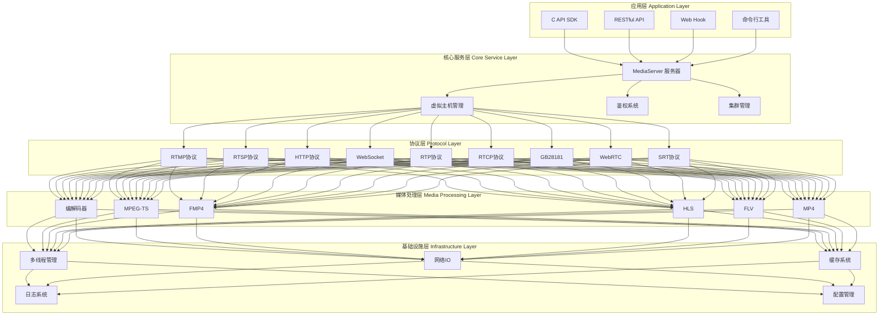

# ZLMedia

---


## 参考

[FFmpeg开发笔记（四十二）使用ZLMediaKit开启SRT视频直播服务_zlmediakit srt-CSDN博客](https://appdev.blog.csdn.net/article/details/140066676?spm=1001.2101.3001.6650.2&utm_medium=distribute.pc_relevant.none-task-blog-2~default~YuanLiJiHua~Ctr-2-140066676-blog-127977795.235^v43^pc_blog_bottom_relevance_base3&depth_1-utm_source=distribute.pc_relevant.none-task-blog-2~default~YuanLiJiHua~Ctr-2-140066676-blog-127977795.235^v43^pc_blog_bottom_relevance_base3&utm_relevant_index=5)

[windows编译ZLMediaKit流媒体服务webrtc - 知乎 (zhihu.com)](https://zhuanlan.zhihu.com/p/685503278)

[【20240227】银河麒麟V4系统（4.4.131-20200604）源码编译ZLMediaKit_srtp 未找到, webrtc 相关功能打开失败-CSDN博客](https://blog.csdn.net/qq_43252610/article/details/136380955)

[音视频学习--zlmediakit TLS加密走读（1） - 知乎 (zhihu.com)](https://zhuanlan.zhihu.com/p/687763685)

[ZLMediaKit 服务器源码解读---事件循环 - 知乎 (zhihu.com)](https://zhuanlan.zhihu.com/p/665743649)

[ZLMediaKit - 钟齐峰 - 博客园 (cnblogs.com)](https://www.cnblogs.com/zhongqifeng/p/17640469.html)

[zlmediakit源码学习（扩展支持算法分析） - 飞翔天空energy - 博客园 (cnblogs.com)](https://www.cnblogs.com/feixiang-energy/p/17656212.html)

[合作项目 | ZLMediaKit](https://docs.zlmediakit.com/zh/more/collaborative_projects.html)

[zlmediakit架构 zlmediakit源码解析_mob64ca13fe1aa6的技术博客_51CTO博客](https://blog.51cto.com/u_16213607/9347039)

[ZLMediaKit源码分析（一）服务启动_zlmediakit源码解析-CSDN博客](https://blog.csdn.net/cliffordl/article/details/131105855)

[zlmediakit Recorder 源码解析 zevms源码_mob64ca14061c9e的技术博客_51CTO博客](https://blog.51cto.com/u_16213641/10547742)

[开源媒体服务器： ZlMediaKit - 阿风小子 - 博客园 (cnblogs.com)](https://www.cnblogs.com/kn-zheng/p/17192654.html)


## 项目概述

###  基本介绍

- 基于 C++11 开发的高性能运营级流媒体服务框架
- 支持多种主流流媒体协议（RTSP、RTMP、HLS、HTTP-FLV、WebRTC等）
- 采用多路复用/多线程/异步网络 IO 模式
- 支持跨平台部署（Linux、MacOS、Windows、iOS、Android）

### 主要特点

- 基于C++11开发，避免使用裸指针，代码稳定可靠
- 支持多种协议互转
- 使用多路复用/多线程/异步网络IO模式
- 代码经过商业验证
- 支持全平台
- 支持多种指令集平台
- 支持画面秒开、极低延时

## 目录结构

### 主要目录

#### 源代码相关目录

```
src/            - 核心源代码目录
├── Common/     - 通用基础组件
├── Codec/      - 编解码相关实现
├── Extension/  - 扩展功能模块
└── ...         - 各种协议实现目录
```

- `src/` 核心源码目录
  - 包含所有核心功能实现
  - 按功能模块划分子目录
  - 包含各种协议的具体实现

#### 依赖和第三方库

```
3rdpart/        - 第三方依赖库
cmake/          - CMake构建脚本和配置
```

#### 接口和示例

```
api/            - C API接口目录
tests/          - 测试用例和示例代码
```

- `api/` 接口目录
  - 提供C语言API接口
  - 便于其他语言调用
  - 包含接口文档和示例
- `tests/` 测试目录
  - 单元测试用例
  - 集成测试用例
  - 使用示例代码

####  部署和配置

```
conf/           - 配置文件目录
docker/         - Docker相关文件
release/        - 发布相关文件
build/          - 构建输出目录
```

- `conf/ `配置目录
  - 默认配置文件
  - 配置模板
  - 环境配置示例
- `docker/ `容器相关
  - `Docker`构建配置
  - 容器运行脚本
  - 环境配置文件

#### 文档和工具

```
www/            - Web相关资源
tools/          - 工具脚本
postman/        - Postman API测试集合
```

- `tools/ `工具目录
  - 辅助脚本
  - 开发工具
  - 运维工具
- `www/` Web资源
  - Web界面资源
  - 静态文件
  - 文档资源

#### 扩展功能目录

```
webrtc/         - WebRTC相关实现
srt/            - SRT协议相关实现
player/         - 播放器相关实现
server/         - 服务器相关实现
ext-codec/      - 扩展编解码实现
```

#### 多平台支持

```
Android/        - Android平台相关代码
golang/         - Go语言相关实现
```

### 重要文件

#### 构建相关

```
CMakeLists.txt          - 主CMake构建配置文件
build_docker_images.sh  - Docker镜像构建脚本
dockerfile              - Docker构建文件
```

- `CMakeLists.txt`
  - 定义项目结构
  - 配置编译选项
  - 管理依赖关系
  - 设置构建目标
- `dockerfile`
  - 定义容器构建过程
  - 配置运行环境
  - 设置依赖安装
  - 配置启动命令

#### 文档文件

```
README.md             - 中文说明文档
README_en.md          - 英文说明文档
LICENSE               - 开源协议
AUTHORS               - 贡献者列表
```

- `README.md/README_en.md`
  - 项目介绍
  - 安装说明
  - 使用文档
  - API说明
  - 贡献指南

####  配置文件

```
default.pem          - 默认SSL证书
ZLMVersion.h.ini     - 版本信息配置
sources.list         - 源列表配置
```

#### CI/CD相关

```
.github/            - GitHub Actions配置
.gitignore          - Git忽略配置
.gitmodules         - Git子模块配置
.clang-format       - 代码格式化配置
```

- `.clang-format`
  - 代码格式化规则
  - 确保代码风格统一
  - 便于团队协作


## 系统架构

### 核心架构组件

#### 基础组件

- `Common/`: 通用基础组件，包含工具类和基础设施
- `Extension/`: 扩展功能模块
- `Codec/`: 音视频编解码相关实现

#### 协议实现层

- `Rtmp/:` RTMP 协议实现
- `Rtsp/:` RTSP 协议实现
- `Http/: HTTP` 协议实现
- `Rtp/: `RTP 协议实现
- `Rtcp/: `RTCP 协议实现
- `Srt/: `SRT 协议实现
- `TS/:` MPEG-TS 协议实现
- `FMP4/:` FMP4 格式支持

#### 功能模块

- `Player/:` 播放器相关实现
- `Pusher/:` 推流相关实现
- `Record/:` 录制功能实现
- `Shell/: `命令行工具实现

### 架构分层




## 扩展性设计

### 接口支持

- 提供标准 `C API `接口
- 支持` Web Hook `实现业务逻辑扩展
- 提供完整的 `RESTful API `接口

### 配置管理

- 支持配置文件热加载
- 支持虚拟主机隔离


## 部署方案

### 部署方式

- 支持传统编译部署
- 提供 `Docker `镜像支持
- 支持 `Kubernetes `部署
- 支持多种平台和架构

### 安全特性

- 支持 `RTSP/RTMP `等协议的鉴权
- 支持 `HTTPS/WSS` 等安全传输
- 支持推拉流鉴权
- 支持 `HTTP API `访问鉴权

